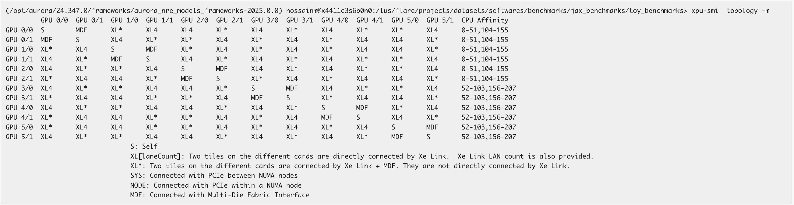
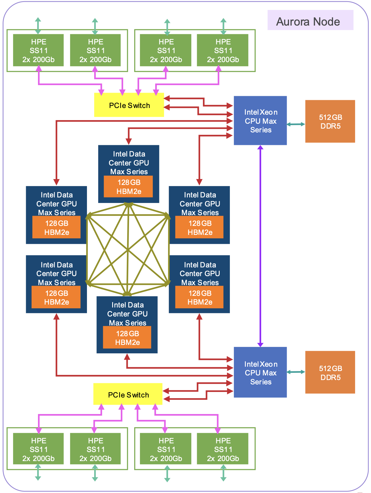

# AI frameworks at scale

**Learning Goals:**

* How to efficiently load Python environments at scale using Copper
* Best practices to efficiently train a PyTorch model on Aurora GPUs at scale


## Overview

Training deep a learning model on 1000s (or more) GPUs may stress various components of a High Performance Computing system. 
Here we discuss and propose solutions for potential issues you might encounter with two critical aspects of deep learning at scale: 

1. [Input/Output (Copper)](#input%2FoutputInput/Output%3A-copper-for-scalable-data-loading)
1. [CPU affinity and bindings](CPU-affinity-and-bindings)
1. [Communication (oneCCL)](#communication%3A-oneccl)


## Input/Output: Copper for scalable data loading

Loading a Python module (e.g. `import torch` of `import numpy`) at scale can take several minutes if the file containing the module is stored on a distributed file system like Lustre (`/lus/flare` on Aurora), and thousands of processes (MPI ranks) try to read that same file simultaneously.

[Copper](https://docs.alcf.anl.gov/aurora/data-management/copper/copper/) is a **read-only** cooperative caching layer aimed to enable scalable data loading on massive amounts of compute nodes. This aims to avoid the I/O bottleneck in the storage network and effectively use the compute network for data movement.

Basically, instead of all the nodes directly contacting and loading the files from lustre, only one node will contact and load from lustre and distribute it to the other nodes.

Here is a performance comparison of `import torch` with and without Copper (lustre results can vary when there is contention and interference on lustre or storage network):

| num nodes | num ranks per node | without copper | with copper |
| :-------: | :----------------: | -------------- | ----------- |
|    64     |         12         | 105 seconds    | 50 seconds  |
|    128    |         12         | 110 seconds    | 52 seconds  |
|    256    |         12         | 110 seconds    | 54 seconds  |
|    512    |         12         | 115 seconds    | 56 seconds  |
|   1024    |         12         | 4 minutes      | 58 seconds  |
|   2048    |         12         | 7 minutes      | 58 seconds  |
|   4096    |         12         | 8 minutes      | 59 seconds  |
|   8192    |         12         | 17 minutes     | 60 seconds  |


> 🛑  **Note**: Copper is not needed if you only use packages from the system installed [`frameworks` module](https://docs.alcf.anl.gov/aurora/data-science/python/#aiml-framework-module). 
Use it only when you need to import Python modules from user-defined conda environments or virtual environments.


### ⌨️   Hands on

Here we show how to use Copper on Aurora to import `torch` from a user-defined conda environment. 

1. [Login to Aurora](https://docs.alcf.anl.gov/aurora/getting-started-on-aurora/):
   ```bash
   ssh <username>@aurora.alcf.anl.gov
   ```
1. Submit the script [`simple_with_copper.sh`](examples/ai_at_scale/simple_with_copper.sh) from the directory `./examples/ai_at_scale/` of this repository:
   ```bash
   qsub simple_with_copper.sh
   ```
   (The example script will run on 2 nodes only, so that multiple people can test it at the same time. Feel free to edit the line `#PBS -l select=2` to test it on a higher number of nodes.)

##### Here is a breakdown of what the above script is doing:

1. Launch Copper
   ```bash
   module load copper
   launch_copper.sh
   ```

1. If you have a local conda environment located at `LUS_CONDA_PATH=/lus/flare/projects/alcf_training/softwares/copper-lus-pip-custom-package`, and you want to use Copper, you need to: 
   - Add `/tmp/${USER}/copper/` to the beginning of the path to your conda environment:
      ```bash
      /tmp/${USER}/copper/${LUS_CONDA_PATH}
      ```
   - Append the modified environment path to your `PYTHONPATH`
      ```bash
      PYTHONPATH=/tmp/${USER}/copper/${LUS_CONDA_PATH}:$PYTHONPATH
      ```
      in your `mpiexec`:
      ```bash
      time mpirun --np ${NRANKS} --ppn ${RANKS_PER_NODE} \
          --cpu-bind=list:4:9:14:19:20:25:56:61:66:71:74:79 --genvall \
          --genv=PYTHONPATH=/tmp/${USER}/copper/lus/flare/projects/alcf_training/softwares/copper-lus-pip-custom-package \
      	python3 -c "import torch; print(torch.__file__)"
      ```

## CPU affinity and bindings
Binding the available CPU cores to appropriate devices (GPU tiles) is of 
critical importance, as this is way to leverage the architectural features in 
an optimal way. The following diagrams show the schematics of the connectivity
of the 6 GPUs (12 tiles) with the 2 CPUs (sockets).


Also, the output of the 
```bash
## From a compute node
module load xpu-smi
xpu-smi topology -m
```
shows the affinity of each GPU to a particular socket. 

In choosing our CPU bindings we should be mindful about the fact the fact that
cores from CPU 0 should be pinned to GPU 0, 1 and 2, and CPU 1 should be used 
for the other 3.

### What if we do not do any bindings?
A quick answer: applications will run, at scale too, but the performance will
hamper. Let's first check how the bindings look like if we do not explicitly
bind them to the cores that we want, i.e. rely on the system default.
```bash
hossainm@x4401c2s0b0n0:~> mpiexec -n 12 -ppn 12 numactl --show | grep "physcpubind"
physcpubind: 1
physcpubind: 2
physcpubind: 3
physcpubind: 4
physcpubind: 5
physcpubind: 6
physcpubind: 7
physcpubind: 8
physcpubind: 9
physcpubind: 10
physcpubind: 11
physcpubind: 12
```
Notice that, the system by default binds cores 1-12 to ranks 0-11, all picked 
up from the socket 0.

Now if we use the binding `--cpu-bind list:4:9:14:19:20:25:56:61:66:71:74:79`
we get
```bash
hossainm@x4401c2s0b0n0:~> mpiexec -n 12 -ppn 12 --cpu-bind list:4:9:14:19:20:25:56:61:66:71:74:79 numactl --show | grep "physcpubind"
physcpubind: 4
physcpubind: 9
physcpubind: 14
physcpubind: 19
physcpubind: 20
physcpubind: 25
physcpubind: 56
physcpubind: 61
physcpubind: 66
physcpubind: 74
physcpubind: 71
physcpubind: 79
```
picking up cores appropriately from two different sockets for GPUs with 
affinity for different sockets. The implication here is, if a core from 
socket 0 wants to off-load a kernel on tile 12 of GPU 6, it will have to go
through multiple hops, and more importantly across another socket -- ideally,
we would like to keep this hop distance to minimum.

## Communication: oneCCL

Training a deep learning model on multiple GPUs requires that the results of computation done on one GPU are communicated to other GPUs. 
This is done using collective operations, like _AllReduce_, which, on Aurora, are enabled by the [oneAPI Collective Communication Library (oneCCL)](https://docs.alcf.anl.gov/aurora/data-science/frameworks/oneCCL/). 
The oneCCL library provides various algorithms for each collective operation, as well as several possible settings for those algorithms. 

One of the critical components of scaling out an application is the inter-node
communication which involves the network interconnects (NICs). Each Aurora 
compute node has 8 NICs, with each socket connected to 4 of them
Following is a 
diagram of an aurora compute node and appropriate NIC to core binding list 
based on the node architecture


|               NIC 0               |               NIC 1               |               NIC 2               |               NIC 3               |               NIC 4               |               NIC 5               |               NIC 6               |               NIC 7               |
| :-------------------------------: | :-------------------------------: | :-------------------------------: | :-------------------------------: | :-------------------------------: | :-------------------------------: | :-------------------------------: | :-------------------------------: |
|                 0                 |                 1                 |                 2                 |                 3                 |                52                 |                53                 |                54                 |                55                 |
| <span style="color:red">4</span>  |                 5                 |                 6                 |                 7                 | <span style="color:red">56</span> |                57                 |                58                 |                59                 |
|                 8                 | <span style="color:red">9</span>  |                10                 |                11                 |                60                 | <span style="color:red">61</span> |                62                 |                63                 |
|                12                 |                13                 | <span style="color:red">14</span> |                15                 |                64                 |                65                 | <span style="color:red">66</span> |                67                 |
|                16                 |                17                 |                18                 | <span style="color:red">19</span> |                68                 |                69                 |                70                 | <span style="color:red">71</span> |
| <span style="color:red">20</span> |                21                 |                22                 |                23                 |                72                 |                73                 | <span style="color:red">74</span> |                75                 |
|                24                 | <span style="color:red">25</span> |                26                 |                27                 |                76                 |                77                 |                78                 | <span style="color:red">79</span> |
|                28                 |                29                 |                30                 |                31                 |                80                 |                81                 |                82                 |                83                 |
|                32                 |                33                 |                34                 |                35                 |                84                 |                85                 |                86                 |                87                 |
|                36                 |                37                 |                38                 |                39                 |                88                 |                89                 |                90                 |                91                 |
|                40                 |                41                 |                42                 |                43                 |                92                 |                93                 |                94                 |                95                 |
|                44                 |                45                 |                46                 |                47                 |                96                 |                97                 |                98                 |                99                 |
|                48                 |                49                 |                50                 |                51                 |                100                |                101                |                102                |                103                |

Now, if we compare this to not selecting any binding, we will end up in a 
situation where _none_ of the ranks are within the minimum hop distance 
to the NICs on socket two.

To demonstrate the significance of the issue, we have done experiments by 
performing an _Allreduce_ with a buffer of 1 GB up to moderate scales with 
12 ranks per node, with and without bindings, and measured the time, and the
results are the following:

| Nodes | No Bindings (NB) ms | With Bindings (WB) ms | % Differnce (abs(NB - WB) / WB) |
|:-----:|:-----:|:-----:|:-----:|
| N64xR12 | 141 | 120 | 17.5% |
| N128xR12 | 146 | 126 | 16% |
| N256xR12 | 347 | 246 | 41% |
| N512xR12 | 367 | 290 | 27% |

These are the average timing of 7 iterations of the _Allreduce_ measured on the 
rank 0 (we left the first 2 and the last iteration out of the averaging). The
_Allreduce_ is done with a single communicator. Complicated situations, for
example the data parallel _Allreduce_ in large language model training, which
involves sub-communicators for specific group of ranks, we expect the 
performance penalty to be even higher.

> **Note**: These results are just an illustrative example, more trials and statistics
based upon run to run variation needs to be performed.

We have run a comprehensive set of tests to measure the performance of different oneCCL configurations when training various deep learning models at scale. 
Though the best oneCCL configuration is application dependent, we have identified a set of [optimal settings](https://docs.alcf.anl.gov/aurora/data-science/frameworks/oneCCL/) that work well for most applications and made those available in a dedicated module, called `frameworks_optimized`. 
The command `module show frameworks_optimized` lists the complete list of settings.

> **Note**: The settings in the `frameworks_optimized` module are valid for *typical* runs, for example assuming that the application is running on 12 ranks per node and setting the CPU bindings and oneCCL affinities accordingly. To override any of these settings, you can manually set a different value for any environment variable.


### ⌨️   Hands on

Here we show how to run an example using the optimized setup of the `frameworks_optimized` module. 

1. Load the `frameworks_optimized` module:
   ```bash
   module use /soft/datascience/frameworks_optimized/
   module load frameworks_optimized
   ```
1. Run the script on 24 tiles, 12 per node:
   ```bash
   mpiexec -n 24 -ppn 12 --cpu-bind=${CPU_BIND} python pytorch_ddp.py
   ```
   where the environment variable `${CPU_BIND}` is set when loading the module.


## Additional Resources

- [oneCCL on Aurora documentation](https://docs.alcf.anl.gov/aurora/data-science/frameworks/oneCCL/)
- [Copper repository](https://github.com/argonne-lcf/copper/tree/main), [Copper documentation](https://alcf-copper-docs.readthedocs.io/en/latest/), [Copper paper](https://www.computer.org/csdl/proceedings-article/sc-workshops/2024/555400b320/23l2GFdlusU)

