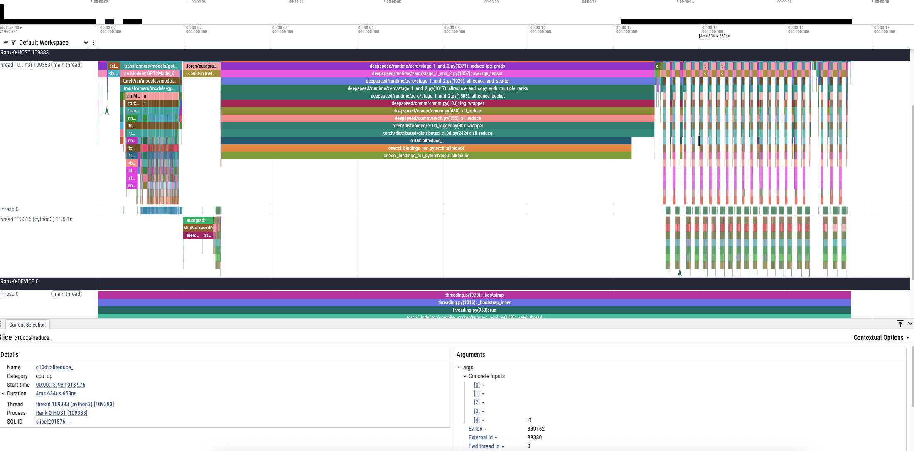

# Profiling Python applications with torch.profiler and dftracer

Author: Huihuo Zheng, <huihuo.zheng@anl.gov> <br>
Dated: May 7, 2025

We here introduce two useful profiling tools for profiling Python applications, one is Torch profiler for compute and communication profiling, and dftracer for I/O profiling. One can combine the traces from both profilers to get a holistic view of the application execution. 

## PyTorch Profiler
PyTorch profiler and measure the time and memory consumption of the model’s operators. It includes simple profiler API that is useful when user needs to determine the most expensive operators in the model.

1. Import all necessary libraries
    ```python
    from torch.profiler import profile, record_function, ProfilerActivity
    ```

2. Using profiler to analyze execution time
    PyTorch profiler is enabled through the context manager and accepts a number of parameters, some of the most useful are:

    **activities** - a list of activities to profile:
    - **ProfilerActivity.CPU** - PyTorch operators, TorchScript functions and user-defined code labels (see record_function below);

    - **ProfilerActivity.CUDA** - on-device CUDA kernels;

    - **ProfilerActivity.XPU** - on-device XPU kernels;

    **record_shapes** - whether to record shapes of the operator inputs;

    **profile_memory** - whether to report amount of memory consumed by model’s Tensors;

3. how we can use profiler to analyze the execution time
    ```python
    with profile(activities=[ProfilerActivity.CPU], record_shapes=True) as prof:
        with record_function("model_inference"):
            model(inputs)
    prof.export_chrome_trace("trace.json")
    ```

4. Visualizing the trace using https://ui.perfetto.dev/


## dftracer
DFTracer is an I/O profiling tool with the capability of doing application‑level as well as low‑level I/O profiling. Current I/O profilers such as Darshan and Recorder do not allow application‑level and I/O‑level profiling, which makes it hard to analyze workloads such as AI and workflows. To this end, DFTracer provides a C++ profiler with bindings to C and Python, intercepting low‑level POSIX calls while also capturing application‑level calls via its APIs 

1. Installing the package
    ```bash
    pip install pydftracer==1.0.5
    ```

2. Initialize
    ```python
    from dftracer.logger import dftracer as PerfTrace, dft_fn as Profile
    PerfTrace.initialize_log(logfile=f"{args.trace_dir}/trace-{rank}-of-{world_size}.pfw", \
        data_dir=f"{args.data}", \
        process_id=rank)
    ```
3. Annotate specific function 
    ```python
    from dftracer.logger import dft_fn as Profile
    dlp_data = Profile("DataLoader")
    class DataLoader(datasets.ImageFolder):
        @dlp_data.log
        def preprocess(self, sample, target):
            if self.transform is not None:
            Easy to use
            sample = self.transform(sample)
            if self.target_transform is not None:
            target = self.target_transform(target)
            return sample, target

        @dlp_data.log
        def read_data(self, index):
            path, target = self.samples[index]
            return self.loader(path), target

        @dlp_data.log
        def __getitem__(self, index):
            sample, target = self.read_data(index)
            return sample, target
    ```

This will generate *.pfw files which can also be visualized using https://ui.perfetto.dev/. One might have to add "[" to the first line and "]" at the end of the file if it is not there. 

## Examples
Python code: [./test_miniGPT.py](./test_miniGPT.py) <br>
Submission script: [./qsub.sc](./qsub.sc) <br>
Flat profiling: 
```
-------------------------------------------------------  ------------  ------------  ------------  ------------  ------------  ------------  ------------  ------------  ------------  ------------  ------------  ------------  
                                                   Name    Self CPU %      Self CPU   CPU total %     CPU total  CPU time avg      Self XPU    Self XPU %     XPU total  XPU time avg       CPU Mem  Self CPU Mem    # of Calls  
-------------------------------------------------------  ------------  ------------  ------------  ------------  ------------  ------------  ------------  ------------  ------------  ------------  ------------  ------------  
                                            aten::addmm         0.27%     291.210ms        34.22%       37.341s       6.946ms       0.000us         0.00%     102.471ms      19.061us           0 b           0 b          5376  
                          onednn_addmm(1024, 1536, 512)        16.38%       17.871s        16.39%       17.885s      26.614ms       7.384ms         0.87%       7.384ms      10.989us           0 b           0 b           672  
                                       c10d::allreduce_         0.00%     438.366us        13.21%       14.416s     465.021ms       0.000us         0.00%     147.924ms       4.772ms           0 b           0 b            31  
                 oneccl_bindings_for_pytorch::allreduce         0.00%     128.987us        13.21%       14.415s     465.007ms       0.000us         0.00%     147.924ms       4.772ms           0 b           0 b            31  
            oneccl_bindings_for_pytorch::xpu::allreduce        13.19%       14.387s        13.21%       14.415s     465.003ms     147.924ms        17.47%     147.924ms       4.772ms           0 b           0 b            31  
                                              aten::pow        11.18%       12.204s        11.25%       12.273s       9.132ms      21.916ms         2.59%      21.916ms      16.307us           0 b           0 b          1344  
                                       aten::logical_or         4.34%        4.732s         8.67%        9.465s     473.245ms     211.040us         0.02%     422.080us      21.104us           0 b           0 b            20  
                                              aten::add         7.89%        8.613s         7.94%        8.669s       3.164ms      44.535ms         5.26%      44.535ms      16.254us           0 b           0 b          2740  
                                            aten::isnan         5.37%        5.857s         5.37%        5.858s     585.755ms     249.600us         0.03%     249.600us      24.960us           0 b           0 b            10  
                                        aten::embedding         0.00%     599.290us         5.23%        5.704s     135.816ms       0.000us         0.00%     598.560us      14.251us           0 b           0 b            42  
                                     aten::index_select         5.23%        5.701s         5.23%        5.704s     135.799ms     598.560us         0.07%     598.560us      14.251us           0 b           0 b            42  
                                              aten::max         4.02%        4.389s         4.02%        4.390s     438.974ms     339.040us         0.04%     339.040us      33.904us           0 b           0 b            10  
                                              aten::mul         3.55%        3.876s         3.81%        4.152s     558.513us      85.525ms        10.10%      85.525ms      11.505us          48 b          48 b          7434  
                                             aten::div_         3.69%        4.031s         3.70%        4.032s     192.010ms       4.164ms         0.49%       4.164ms     198.293us           0 b           0 b            21  
                                          aten::dropout         0.00%       2.948ms         3.18%        3.473s       2.544ms       0.000us         0.00%      30.056ms      22.019us           0 b           0 b          1365  
                                   aten::native_dropout         2.95%        3.214s         3.18%        3.470s       2.542ms      30.056ms         3.55%      30.056ms      22.019us           0 b           0 b          1365  
     autograd::engine::evaluate_function: TanhBackward0         0.00%       3.033ms         3.14%        3.425s       5.097ms       0.000us         0.00%       9.623ms      14.320us           0 b           0 b           672  
                                          TanhBackward0         0.00%       1.758ms         3.14%        3.422s       5.092ms       0.000us         0.00%       9.623ms      14.320us           0 b           0 b           672  
                                    aten::tanh_backward         3.12%        3.407s         3.13%        3.420s       5.089ms       9.623ms         1.14%       9.623ms      14.320us           0 b           0 b           672  
                                             aten::mean         2.91%        3.171s         2.91%        3.171s     151.010ms     106.880us         0.01%     106.880us       5.090us           0 b           0 b            21  
                                              aten::div         2.66%        2.906s         2.66%        2.907s      69.212ms     366.080us         0.04%     366.080us       8.716us           0 b           0 b            42  
                                               aten::mm         1.78%        1.938s         1.96%        2.142s     393.910us      80.712ms         9.53%      80.712ms      14.840us           0 b           0 b          5439  
                                       aten::layer_norm         0.00%       2.715ms         1.71%        1.869s       1.369ms       0.000us         0.00%      20.229ms      14.820us           0 b           0 b          1365  
                                aten::native_layer_norm         1.66%        1.813s         1.71%        1.867s       1.367ms      20.229ms         2.39%      20.229ms      14.820us           0 b           0 b          1365  
                                             aten::tanh         1.69%        1.839s         1.70%        1.854s       2.759ms      14.321ms         1.69%      14.321ms      21.311us           0 b           0 b           672  
    autograd::engine::evaluate_function: AddmmBackward0         0.03%      29.431ms         1.50%        1.638s     609.526us       0.000us         0.00%     122.049ms      45.405us           0 b           0 b          2688  
```


Torch timeline trace (2-nodes): 



## Merge timeline traces from different ranks or different profilers
```bash
pip install git+https://github.com/zhenghh04/pyutils
merge_trace --file-list ./miniGPT_trace/torch-trace-0-of-24.json ./miniGPT_trace/trace-0-of-24.pfw --output combine-trace-0-of-24.json
```

## Current Limitations on Aurora
* For more than one nodes, currently ``ProfilerActivity.XPU`` will cause hang. So we suggest to do ProfilerActivity.XPU in single node, and then in multiple node, turn that off. 
* For dftracer, the lower level POSIX I/O profiling has issue on Aurora. One has to set ``DFTRACER_DISABLE_IO=1``

## References
[1] https://docs.pytorch.org/docs/stable/profiler.html <br>
[2] https://github.com/pytorch/pytorch/blob/main/torch/cuda/profiler.py <br>
[3] https://dftracer.readthedocs.io/en/v1.0.4/overview.html

